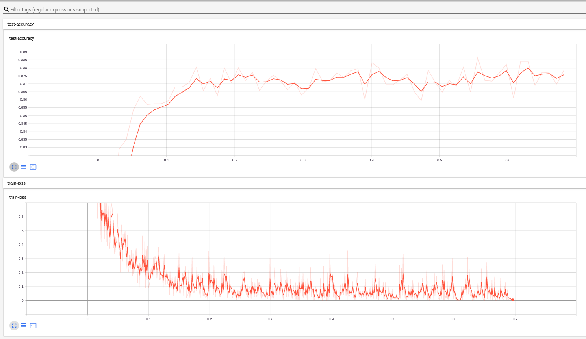

# PyTroch implementation of Sketch-a-Net

This repository implements the Sketch-A-Net (Paper: https://arxiv.org/abs/1501.07873) in PyTorch but uses the QuickDraw dataset (https://github.com/googlecreativelab/quickdraw-dataset) to train it.

1. Download the binary version of the dataset and prepare (`prepare_quickdraw.py`) it by rasterizing them
2. Train it with `train.py`

Read the description of the argparse to know more about the options

#### Here is the result

